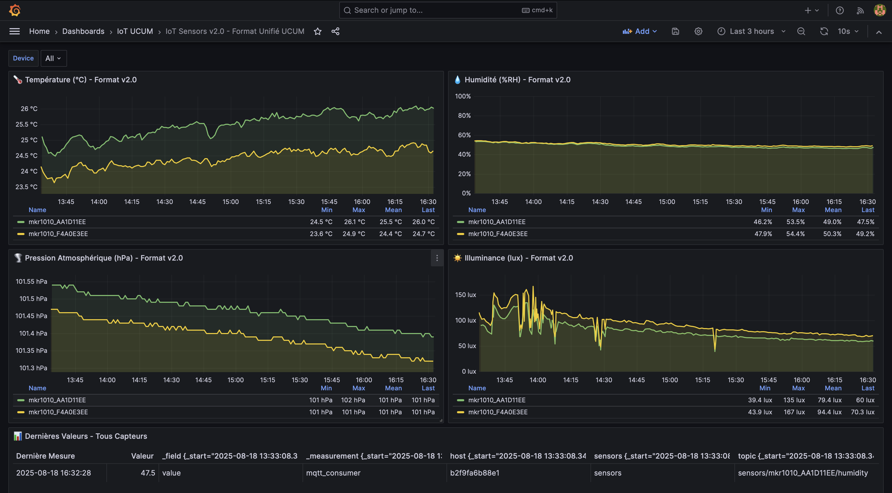

# IoT Sensors UCUM - Monitoring Environnemental Arduino

**Système de monitoring IoT utilisant Arduino MKR WiFi 1010 avec conformité aux standards UCUM (Unified Code for Units of Measure)**

[](CHANGELOG.md)
[](https://www.arduino.cc/en/Guide/MKR1000)
[](https://ucum.org/)
[](LICENSE)

## 🚀 Démarrage rapide

### Prérequis

- Arduino MKR WiFi 1010 + MKR ENV Shield
- Docker & Docker Compose
- Arduino IDE avec bibliothèques : WiFiNINA, ArduinoMqttClient, Arduino_MKRENV, ArduinoECCX08, ArduinoJson

### Installation en 5 minutes

1. **Configuration Arduino**

   ```bash
   cd ~/Documents/Arduino/iot-sensors-ucum
   cp arduino_secrets.h.template arduino_secrets.h
   # Éditer avec vos paramètres WiFi et MQTT
   ```

2. **Déploiement des services Docker**

   ```bash
   cd /Users/dominique/Documents/Programmation/iot-sensors-ucum
   docker-compose up -d
   ```

3. **Upload du firmware Arduino v2.1** via Arduino IDE

4. **Vérification**

   ```bash
   docker-compose ps
   open http://localhost:3000  # Grafana (voir .env pour identifiants)
   ```

**Note sécurité** : Les identifiants Grafana sont maintenant configurés via variables d'environnement dans `.env`. Modifiez `GRAFANA_ADMIN_USER` et `GRAFANA_ADMIN_PASSWORD` selon vos besoins.

## 📊 Fonctionnalités v2.2

### Dashboard Grafana v2.0



*Exemple de dashboard Grafana v2.0 en temps réel avec données des deux Arduinos*

### Capteurs supportés

- **Température** : Standard UCUM `Cel` (°C)
- **Humidité** : Standard UCUM `%` (% RH)
- **Pression** : Standard UCUM `hPa` (hectopascal)
- **Luminosité** : Standard UCUM `lx` (lux)

### Caractéristiques techniques v2.2

- **Format unifié v2.0** : Un seul format de message pour tous les capteurs
- **Compteur de keepalive intelligent** : Simplification avec opérateur modulo
- **Protection débordement** : Variables `unsigned long` avec reset préventif
- **ID unique** basé sur puce crypto ECCX08
- **Transmission MQTT** optimisée avec filtrage LWT
- **Détection de changement** intelligente avec seuils configurables
- **Calibration** des capteurs avec offsets personnalisables
- **Profils de fréquence** prédéfinis (HIGH/MEDIUM/LOW)

### Architecture v2.2

- **Arduino** : Firmware unifié v2.0 avec robustesse améliorée
- **MQTT** : Messages compacts `{"v": value, "u": "unit", "t": "timestamp"}`
- **Telegraf** : Configuration simplifiée pour mesures uniquement
- **InfluxDB** : Structure optimisée avec fields `value`, `ucum_code`, `sensor_timestamp`
- **Grafana** : Dashboard v2.0 avec panels optimisés et table récapitulative

## ⚙️ Configuration v2.2

### Format unifié Arduino (v2.0)

```cpp
// Un seul test pour envoi : changement OU keepalive
if (abs(temperature - lastTemperature) >= tempConfig.threshold || forceKeepalive) {
    sendMeasurementUnified("temperature", temperature, tempConfig);
    lastTemperature = temperature;
}

// Compteur intelligent avec modulo
bool forceKeepalive = (measurementCounter % KEEPALIVE_MEASUREMENT_COUNT) == 0;
```

### Messages MQTT v2.0

```json
// Format unifié pour toutes les mesures
{"v": 23.75, "u": "Cel", "t": "2025-08-18T10:16:58Z"}

// Format status simplifié 
{"v": "online", "ip": "192.168.1.122", "t": "2025-08-18T10:16:59Z", "c": 19}
```

### Configuration Telegraf v2.1

```toml
# Collecte UNIQUEMENT les mesures (ignore les status/LWT)
topics = ["sensors/+/temperature", "sensors/+/humidity", "sensors/+/pressure", "sensors/+/illuminance"]

# Renommage automatique v → value, u → ucum_code, t → sensor_timestamp
```

### Profils de fréquence

```cpp
// Configuration ultra-simple dans config.h
#define MEASUREMENT_FREQUENCY HIGH    // 10s, keepalive 6 cycles
#define MEASUREMENT_FREQUENCY MEDIUM  // 30s, keepalive 10 cycles (défaut)
#define MEASUREMENT_FREQUENCY LOW     // 60s, keepalive 15 cycles
```

### Protection débordement (v2.1)

```cpp
// Variables robustes
unsigned long measurementCounter = 0;  // 32 bits au lieu de 16
if (measurementCounter >= 1000000UL) { measurementCounter = 0; } // Reset préventif
```

## 📡 Données et API v2.2

### Requêtes InfluxDB optimisées

```flux
// Nouvelle structure de données v2.1
from(bucket: "sensor-data")
  |> range(start: v.timeRangeStart, stop: v.timeRangeStop)
  |> filter(fn: (r) => r["_measurement"] == "mqtt_consumer")
  |> filter(fn: (r) => r["_field"] == "value")
  |> filter(fn: (r) => r["sensor_type"] == "temperature")
  |> aggregateWindow(every: v.windowPeriod, fn: mean, createEmpty: false)
```

### Dashboard Grafana v2.0

- 🌡️ **Température** avec seuils colorés intelligents
- 💧 **Humidité** avec échelle 0-100%
- 🌪️ **Pression** avec seuils météorologiques
- ☀️ **Illuminance** avec gradients lumineux
- 📋 **Table récapitulative** des dernières valeurs
- 🔄 **Refresh automatique** toutes les 10 secondes

### Endpoints services

- **Grafana v2.0** : <http://localhost:3000> (voir .env pour identifiants)
- **InfluxDB** : <http://localhost:8086> (dd/Password$)  
- **MQTT** : 192.168.1.15:1883 (serveur externe)

## 🔧 Administration v2.2

### Surveillance système

```bash
# État des services
docker-compose ps

# Logs Telegraf v2.1
docker-compose logs -f telegraf

# Test direct serveur MQTT externe
mosquitto_sub -h 192.168.1.15 -p 1883 -t "sensors/#"
```

### Validation v2.1

```bash
# Vérifier format unifié des messages
mosquitto_sub -h 192.168.1.15 -p 1883 -t "sensors/+/+" -v

# Vérification données InfluxDB
curl -G 'http://localhost:8086/query' \
  --data-urlencode "q=SELECT * FROM mqtt_consumer WHERE time > now() - 1h"
```

## 🆕 Nouveautés v2.2

### ✅ Améliorations Documentation v2.2

- **Guide Telegraf complet** : Documentation détaillée de la configuration Telegraf
- **Processors expliqués** : Guide étape par étape des transformations
- **Troubleshooting avancé** : Solutions aux problèmes Telegraf courants
- **Requêtes optimisées** : Exemples Flux pour InfluxDB
- **Monitoring intégré** : Métriques et debug Telegraf

### ✅ Améliorations Configuration

- **Variables d'environnement** : Configuration Telegraf externalisée
- **Format unifié** : Documentation du processus de transformation
- **Support Feinstaub** : Integration capteurs de particules fines
- **Performance monitoring** : Métriques internes Telegraf

### ✅ Maintenance projet

- **Structure docs/** : Organisation claire de la documentation
- **Standards rédaction** : Blocs de code avec tags appropriés
- **Versioning sémantique** : v2.2.0 avec nouvelles fonctionnalités
- **Git workflow** : Commit et push automatisés

## 📚 Documentation

- **[Guide technique v2.2](docs/TECHNICAL.md)** : Architecture unifiée détaillée
- **[Configuration v2.2](docs/CONFIGURATION.md)** : Guide de configuration simplifiée
- **[Configuration Telegraf](docs/TELEGRAF_CONFIGURATION.md)** : Guide détaillé Telegraf v2.2
- **[Migration v1→v2](docs/MIGRATION.md)** : Guide de migration vers format unifié
- **[Déploiement](docs/DEPLOYMENT.md)** : Installation et mise en production
- **[Dépannage v2.2](docs/TROUBLESHOOTING.md)** : Solutions aux problèmes courants
- **[Historique](CHANGELOG.md)** : Versions et améliorations

## 🏆 Standards et conformité

### Standards respectés v2.1

- **UCUM** : Unified Code for Units of Measure (format compact)
- **IEEE** : Standards de communication électronique  
- **ISO 11240:2012** : Identification des unités
- **MQTT 3.1.1** : Protocole messaging IoT
- **JSON** : Format d'échange de données optimisé

### Validations v2.1

- **Messages unifiés** vérifiés selon format v2.0
- **Métadonnées UCUM** simplifiées mais complètes
- **Validation temps réel** des plages de valeurs
- **Monitoring robuste** sans pollution LWT

## 🚨 Support et contribution

### Signaler un problème

1. Vérifier l'état des services : `docker-compose ps`
2. Consulter [docs/TROUBLESHOOTING.md](docs/TROUBLESHOOTING.md)
3. Créer une issue avec les logs

### Développement v2.1

```bash
# Environnement de développement
git clone [repository]
cd iot-sensors-ucum
git checkout dev-v2

# Démarrage des services v2.1
docker-compose up -d

# Tests format unifié
docker-compose logs telegraf
```

## 📄 Licence

MIT License - Voir [LICENSE](LICENSE) pour détails complets.

---

**Projet IoT Sensors UCUM v2.2.1** - *Correction structure CHANGELOG et conformité Markdown*  
Développé par **Dominique Dessy** - Août 2025
